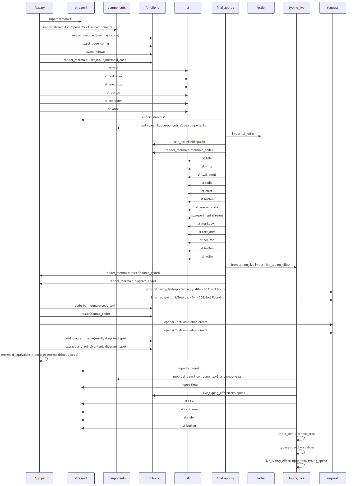

# Repository Code Diagram Generator

This project generates diagrams from GitHub repositories using OpenAI's GPT-3.5 Turbo model and Mermaid. It supports the following diagram types:

- **Class Diagram**: Visualize the relationships and hierarchies between classes and objects in your codebase.
- **Sequence Diagram**: Illustrate the flow of interactions between objects and classes over time.
- **Entity Relationship Diagram**: Display the connections and relationships between entities in your database or codebase.
- **State Diagram**: Show the different states and transitions of a system or object over time.
- **User Journey Diagram**: Map out the user's experience and interactions with your application or system.

## Demo Website

Visit the demo website [here](https://iipacii-flow-final-app-v9snqv.streamlit.app/).

## Features

### Web Interface

- Enter your GitHub repository path or paste your code snippet to generate diagrams.
- Select the diagram type that best suits your needs.
- Click "Generate Diagram" to render the Mermaid diagram in the browser.
- Download the diagram as an SVG file for further editing or sharing.

### OpenAI Integration

- Leverage the power of OpenAI's GPT-3.5 Turbo model to generate accurate and informative diagrams.
- Take advantage of the model's ability to understand code structure and relationships.

### Mermaid Support

- Use Mermaid's syntax and features to customize and extend your diagrams.
- Benefit from Mermaid's flexibility and ease of use for creating complex diagrams.

## Requirements

- OpenAI API key (stored in a `.env` file)
- GitHub API access
- Streamlit
- OpenAI
- Requests
- Dotenv

## Example

Here is an example of the sequence diagram generated:

